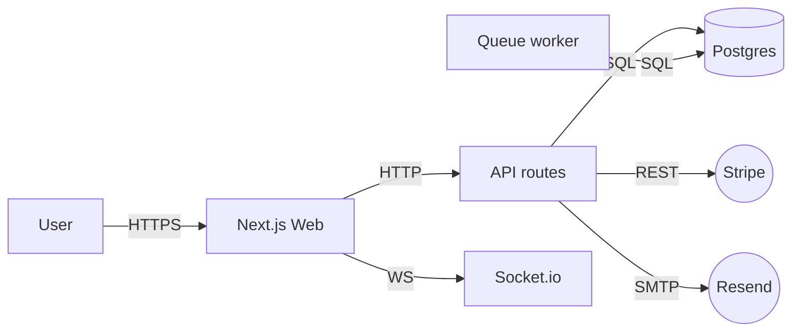

# /architecture-sketch — One-Page System Picture

## Why you'd care

If you can't draw the system on one page, you're going to discover its shape during implementation — at the cost of refactors. The sketch forces the load-bearing decisions (boxes, stores, external deps) out of your head and onto a single artifact others can argue with cheaply.

Before formal design phase: prove you know roughly what you're building. One page max.

## Pre-flight
None. Feeds `/feasibility-spike`, `/api-contract`, `/data-model-design`, `/threat-model`.

## Inputs
- MVP scope.
- Known constraints (tech, latency, scale).

## Process
1. **Identify actors** — humans + external systems that touch the product. 3-7 max for MVP.
2. **Identify surfaces** — frontends, APIs, jobs, queues. Each is one box.
3. **Identify stores** — DB, cache, blob, search index. Each is a cylinder.
4. **Identify externals** — Stripe, OAuth provider, email, SMS, LLM. Each is a cloud.
5. **Draw arrows** — direction = data flow. Label with protocol (HTTP / WS / gRPC / webhook / event).
6. **Annotate hotspots** — latency-sensitive paths, write-heavy paths, single points of failure.
7. **List risks** — top 3 things that could go wrong with this shape.
8. **Mermaid render** — ASCII or mermaid graph in markdown.

## Output
Write `docs/inception/architecture-sketch-<project>.md`:

```markdown
# Architecture Sketch — <project>
**Date:** <YYYY-MM-DD>

## Diagram


## Components
| Box | Role | Tech | Owner |
|-----|------|------|-------|
| Web | UI | Next.js / Vercel | ... |
| API | Business logic | Next.js routes | ... |
| DB | Source of truth | Postgres / Neon | ... |
| Worker | Async jobs | BullMQ / Inngest | ... |

## External dependencies
| Dep | Purpose | SLA | Fallback |
|-----|---------|-----|----------|
| Stripe | Payments | 99.99% | Queue retry |
| Resend | Email | 99.9% | Log + manual |

## Hot paths
1. <user action → response chain> — target p95 <X> ms
2. ...

## Top 3 architectural risks
1. ...
2. ...
3. ...

## Decisions deferred (handled in Design phase)
- API contract specifics → `/api-contract`
- Schema details → `/data-model-design`
- NFR numbers → `/nfr-template`
- Threat surface → `/threat-model`

## Next
- Spike risky parts → `/feasibility-spike`
- Pick stack → `/stack-profile`
- Move to Design phase
```

## Verification
- Single page (≤ 200 lines markdown).
- Mermaid diagram parses.
- Every external has fallback noted.
- Top 3 risks named.
