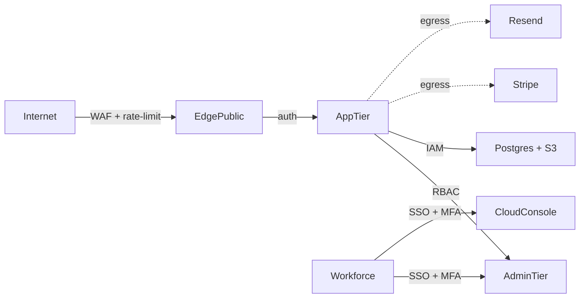

# /attack-surface-pre — Attack Surface Enumeration

## Why you'd care

You can't threat-model what you haven't enumerated, and the forgotten endpoint is always the one that gets exploited. Listing every ingress, trust boundary, and egress before threat-modeling means STRIDE actually covers the system instead of the parts you happened to remember.

Invoke as `/attack-surface-pre`. Inventory every place an adversary can interact. Pairs with `threat-model-pre` (this is the input).

## Pre-flight
1. Read `docs/classify/<project>.md`.
   - XS → SKIP
2. Read `docs/inception/threat-model-pre-<project>.md` if exists.
3. Read `docs/inception/regulatory-<project>.md`.

## Inputs
- Architecture sketch (web app, mobile, API, admin).
- Hosting (cloud, VPC, edge, on-prem, hybrid).
- Third-party integrations (OAuth, payment, email, analytics, support).
- Workforce access (SSH, VPN, IAM console, GitHub, CI/CD).

## Process
1. **Public ingress**:
   - Marketing site / pages (CDN-fronted)
   - SaaS app (auth wall + post-auth)
   - Public API (REST/GraphQL/RPC)
   - Webhooks IN (from Stripe, GitHub, etc.)
   - Email (parsed inbound? then ingress)
   - SMS / phone IVR
   - Mobile app (App Store / Play Store)
2. **Authenticated surface** (post-login):
   - User dashboard
   - Settings / profile / billing
   - File upload / download
   - In-app messaging
   - Real-time (WebSocket / SSE)
3. **Privileged surface**:
   - Admin console (internal users)
   - Support agent impersonation
   - Customer-success tooling
   - Audit / report endpoints
4. **Internal-only surface** (workforce):
   - SSH bastion / VPN
   - Cloud console (AWS/GCP/Azure)
   - GitHub / GitLab
   - CI/CD (Actions / CircleCI / Buildkite)
   - Secrets manager (Vault / KMS)
   - Observability (Datadog / Grafana)
   - HR / payroll / finance SaaS
5. **Egress paths**:
   - Outbound API calls (third-party SaaS)
   - Webhook outbound
   - Email send (SES / Postmark / Resend)
   - SMS send (Twilio)
   - Backup destination (S3 / GCS / cross-region)
   - Log forwarding (SIEM / log-shipper)
6. **Trust zones**:
   - Untrusted (internet)
   - Customer-trusted (post-auth)
   - Privileged (admin)
   - Workforce (employee)
   - Production-data (highest)
   - Crown jewels (signing keys, PII raw store)
7. **Boundary controls**:
   - WAF / Cloudflare / AWS Shield
   - Rate-limit (per-IP, per-user, per-endpoint)
   - Auth gate (session, JWT, API key, mTLS)
   - Authz check (RBAC, ABAC, row-level)
   - VPC / private subnet / SG
   - SSO + MFA gate to workforce
8. **Surface change-rate**:
   - High-churn (new features add surface) → re-scan monthly
   - Low-churn (stable infra) → quarterly
9. **Tooling**:
   - Surface enumeration: AWS Config, ScoutSuite, Prowler
   - External: Detectify, Intruder, Shodan
   - Internal asset DB: ServiceNow CMDB, lightweight Notion table

## Output
Write `docs/inception/attack-surface-<project>.md`:

```markdown
# Attack Surface — <project>
**Date:** <YYYY-MM-DD>

## Public ingress inventory
| Surface | URL/host | Auth required | Trust zone | Owner | Re-scan |
|---|---|:--:|---|---|---|
| Marketing site | www.<domain> | no | untrusted | Marketing | Q |
| SaaS app | app.<domain>/auth/* | no (auth endpoint) | untrusted | Eng | M |
| SaaS app post-auth | app.<domain>/* | yes | customer-trusted | Eng | M |
| Public REST API | api.<domain>/v1/* | API key | untrusted | Eng | M |
| Stripe webhook IN | api.<domain>/webhooks/stripe | signature | untrusted | Eng | M |
| GitHub webhook IN | api.<domain>/webhooks/github | signature | untrusted | Eng | M |
| Inbound email parse | parse@<domain> | none | untrusted | Eng | Q |
| Mobile iOS | App Store | post-launch | customer-trusted | Mobile | M |
| Mobile Android | Play Store | post-launch | customer-trusted | Mobile | M |

## Authenticated surface
| Surface | Path | Authz model | Trust zone | Owner |
|---|---|---|---|---|
| User dashboard | /app | session | customer-trusted | Eng |
| Settings | /app/settings | session + reauth on sensitive | customer-trusted | Eng |
| File upload | /app/upload | session + scope check | customer-trusted | Eng |
| Real-time chat | wss://app.<domain>/socket | session token in handshake | customer-trusted | Eng |

## Privileged surface
| Surface | Path | Authz | Trust zone | Owner |
|---|---|---|---|---|
| Admin console | admin.<domain> | RBAC + IP allowlist + MFA | privileged | Eng |
| Support impersonate | admin.<domain>/impersonate | RBAC + audit log per use | privileged | Support |
| Reports / billing | admin.<domain>/reports | RBAC | privileged | Finance |

## Internal workforce surface
| Surface | Auth | MFA | Audit | Owner |
|---|---|:--:|:--:|---|
| Bastion SSH | hardware key | ✓ | ✓ | Eng |
| AWS console | SSO | ✓ | CloudTrail | Eng |
| GitHub | SSO | ✓ | audit log | Eng |
| CI/CD | OIDC to AWS | n/a | run history | Eng |
| Secrets (KMS) | IAM role | n/a | CloudTrail | Eng |
| Datadog | SSO | ✓ | audit log | Eng |
| HR (Rippling) | SSO | ✓ | audit log | People |

## Egress paths
| Destination | Purpose | Auth | Encrypted | Logged |
|---|---|---|:--:|:--:|
| Stripe API | payment | API key | TLS | ✓ |
| Resend | email | API key | TLS | ✓ |
| Twilio | SMS | API key | TLS | ✓ |
| S3 backup | DR | IAM role | TLS + KMS | ✓ |
| Datadog log ship | observability | API key | TLS | ✓ |

## Trust zone diagram (mermaid)


## Boundary controls
| Boundary | Control | Tool |
|---|---|---|
| internet → edge | WAF + DDoS | Cloudflare |
| edge → app | rate-limit | Cloudflare + app middleware |
| app → admin | RBAC + IP allowlist | app authz |
| app → DB | least-priv role | Postgres roles |
| workforce → cloud | SSO + MFA | AWS SSO |
| egress | allowlist (SOC 2 evidence) | NACL + SG |

## Surface change cadence
- High-churn (app + API): monthly re-enumerate
- Mid-churn (admin + workforce): quarterly
- Low-churn (infra topology): biannual
- Auto: external scan via Detectify weekly

## Effort + cost
| Activity | Cost |
|---|--:|
| Initial enumeration | 1 wk eng |
| External scanner (Detectify) | $5k/yr |
| Quarterly review | 1 d eng |
| Surface drift alert (IaC diff) | included in CI |
| **Y1 total** | **~$5k + 2 wk dev** |

## Risk if skipped
- Unknown internet-facing asset → breach via forgotten S3 bucket / staging URL
- No trust-zone discipline → lateral movement on compromise
- Egress unbounded → exfil undetected
- Workforce surface unmapped → insider risk uncatalogued

## Verification
- Every public hostname listed
- Every auth boundary named
- Trust zones declared
- Egress destinations enumerated
- Re-scan cadence set
```

## Verification
- Public ingress complete.
- Privileged + workforce surfaces named.
- Trust zones declared with diagram.
- Egress paths catalogued.
- Boundary controls mapped per zone.
