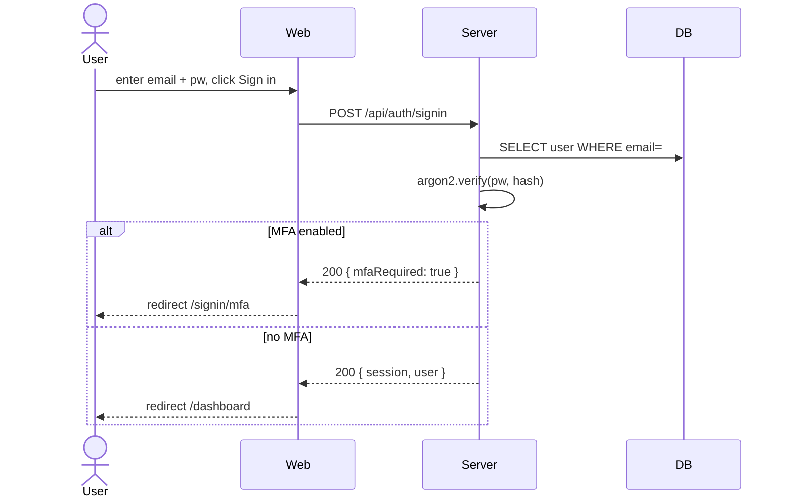
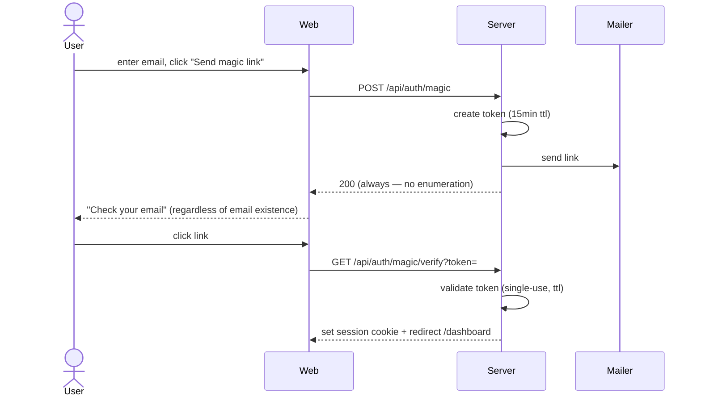

# Auth Flow Design

## Why you'd care

Every error path in auth is a lockout for a paying user; every success path is a hijack vector. Designing the screens, transitions, and recovery paths before code is how you avoid the 3am support ticket about a customer who can't get back in.

Auth is high-stakes UX: every error path is a lockout risk, every success path a security risk. This skill designs the screens + transitions + recovery paths for every supported auth method.

## When This Skill Applies

Activate when:
- User says "auth flow", "login", "signup", "sign in", "password reset", "2FA", "MFA", "OAuth", "SSO", "magic link", "session expiry", "/auth-flow-design"
- New product needing auth from scratch
- Adding a method (OAuth provider, MFA, magic-link)
- Audit of existing auth UX (lockouts, abandonment)
- Compliance requirement (MFA mandate, session timeout policy)

## Prerequisites

- Auth methods chosen (password / OAuth providers / magic-link / passkey).
- Session policy decided (duration, refresh strategy).
- Email/SMS provider chosen for verification + reset.
- Decision: account-creation gate (email verify required? optional?).

## Steps

1. **Enumerate methods.** Email+password, OAuth (Google/Apple/etc), magic-link, passkey, SSO. Per method: sign-up + sign-in + recovery.
2. **Map screens.** sign-up, sign-in, verify-email, forgot-password, reset-password, mfa-challenge, mfa-enroll, session-expired, account-locked.
3. **Sequence per method.** Mermaid sequence diagrams: happy path + each failure branch.
4. **Error matrix.** Per error code (wrong-pw, locked, unverified, expired-token), define: copy, retry policy, recovery action.
5. **Lockout policy.** Threshold, duration, unlock path. Display countdown? Surface unlock email?
6. **MFA UX.** Enroll flow, challenge UI, backup codes, lost-device recovery, remember-this-device toggle.
7. **OAuth UX.** Button order, account-linking on email collision, scope-deny path.
8. **Session expiry.** Idle timeout warning, hard expiry, re-auth modal vs full redirect, return-to-where-I-was.
9. **A11y.** Password field show/hide, MFA code inputs (6 single boxes vs one), focus management on error.
10. **Write** `docs/design/auth-flow.md`.
11. **Auto-chain.** Per method's submit form → `/form-design`. Token storage / session → `/threat-model`. Email content → `/email-template-design` (if exists).

## Output Format — `docs/design/auth-flow.md`

```markdown
---
last-updated: YYYY-MM-DD
status: draft | reviewed | implemented
methods: email+password, google-oauth, magic-link
session: 7d sliding, refresh on activity, idle-warn at 6d23h
---

# Auth Flow

## Methods Enabled

| Method | Sign-up | Sign-in | Recovery |
|--------|---------|---------|----------|
| Email + password | yes | yes | password reset via email |
| Google OAuth | yes | yes | n/a (Google handles) |
| Magic link | yes | yes | re-request link |
| Passkey | post-MVP | post-MVP | — |

## Screen Map

| Slug | Path | Purpose |
|------|------|---------|
| signup | /signup | Email + password OR OAuth OR magic-link entry |
| signin | /signin | Same methods |
| verify-email | /verify?token=… | Confirm email after signup |
| forgot | /forgot | Email entry to start reset |
| reset | /reset?token=… | Set new password |
| mfa-enroll | /settings/mfa | TOTP enroll + backup codes |
| mfa-challenge | /signin/mfa | 6-digit code prompt after password |
| session-expired | modal overlay | Re-enter password without losing context |
| account-locked | /locked | Lockout message + unlock email |

## Sequence — Email+Password Sign-in (happy path)



## Sequence — Magic Link



## Error Matrix

| Error | Copy | Retry policy | Recovery action |
|-------|------|--------------|-----------------|
| wrong password | "Email or password is incorrect" (no enumeration) | unlimited (rate-limited 10/hr) | "Forgot password?" link |
| account locked (5 fails / 15min) | "Too many tries. Try again in N minutes." | locked | "Email me an unlock link" |
| unverified email | "Verify your email first." | n/a | "Resend verification" button |
| MFA wrong code | "Code didn't match. Try again." | 5 tries → re-prompt password | "Use a backup code" |
| MFA backup code used | "That backup code is used. Try the next one or your authenticator." | n/a | "Lost device? Contact support" |
| OAuth email collision | "An account with this email exists. Sign in with password to link Google." | one-shot link flow | "Sign in" then "Connect Google" in settings |
| session expired (idle) | modal: "Session expired. Re-enter password." | 3 tries → redirect signin | full redirect after fail |
| token expired (reset/magic/verify) | "This link expired. Request a new one." | n/a | re-request button |

## Lockout Policy

- 5 failed sign-ins in 15 minutes → lock for 15 minutes.
- Lock duration shown as countdown.
- "Email me an unlock link" available immediately (single-use, 1hr ttl).
- After 3 lock cycles in 24h → require password reset.

## MFA UX

### Enroll
1. Settings → MFA → "Enable".
2. Show QR + manual key for TOTP apps.
3. User enters first code to confirm.
4. Display 8 backup codes (download .txt, copy all). Force "I saved these" checkbox before continue.

### Challenge
- 6-digit single input with auto-tab between digits OR one input that accepts paste of full code.
- Auto-submit on 6th digit.
- "Use backup code" link → switches to single text input (8 chars).
- "Trust this device for 30d" checkbox (cookie, not session).

### Recovery
- "Lost device" link on challenge screen → backup-code flow.
- All backup codes used → "Contact support" path (manual reset, identity proof).

## OAuth UX

- Buttons above email/password (signal: faster path).
- Order: Google, Apple, Microsoft (or by usage data post-launch).
- Single button "Continue with Google" (no separate sign-in / sign-up).
- Email collision: dedicated link-flow screen (don't auto-link without password proof).
- Scope deny: "We need email + name to create your account. Try again?" with retry button.

## Session Expiry UX

- 7-day sliding session, refresh on any authenticated request.
- Idle warning modal at 6d 23h: "Stay signed in?" with 60s countdown → extend or sign out.
- Hard expiry: re-auth modal overlays current page (preserves form state in localStorage); on success, dismiss modal.
- Re-auth fail 3× → full redirect to /signin with `?return=<path>` to restore.

## A11y

- Password field: show/hide toggle is `<button aria-label="Show password" aria-pressed="false">`.
- MFA 6-box: each `<input>` has `aria-label="Digit N of 6"`; group has `<fieldset><legend>Enter verification code</legend>`.
- Error announcements: `role="alert"` on inline error; `aria-live="assertive"` for lockout / session-expired modals.
- Focus on submit fail → first error field.

## Out of Scope

- Account deletion UX (separate `account-deletion-ux` skill).
- Profile / settings UI beyond MFA enroll.
- B2B SSO (SAML/OIDC) — separate flow if added.

## Open Questions

- Passkey rollout date? Defer to post-MVP.
- Social account merge tool? Manual support only for now.
```

## Boundaries

- **No enumeration.** Sign-in errors never confirm whether email exists.
- **No code.** Mermaid diagrams + copy + state. Impl downstream.
- **One file per product's auth.** Don't fragment per-method into separate files; compose all methods in this single contract.
- **Recovery is mandatory for every method.** Method without recovery = lockout risk.
- **Don't redesign primitive components.** Form fields are `/form-design`; this skill defines flow + states.

## Re-run Behavior

- Read existing first; surface diff.
- Bump `last-updated`.
- Status: draft → reviewed → implemented.

## Auto-chain

- Each form (signup, signin, reset) → `/form-design` for field-level spec.
- Session token storage → `/threat-model`.
- Email templates (verify, reset, magic, unlock) → email-template skill if present.
- Lockout / rate-limit thresholds → `/api-contract` for limits.

## Example Trigger

User: "design the auth flow with email+password and Google OAuth"
→ Map screens, sequence per method, error matrix, lockout + MFA + session policy, write `docs/design/auth-flow.md`.
