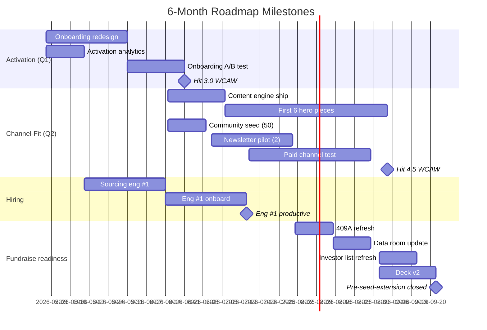

# /milestone-gantt — See The Critical Path Or Slip For No Reason

## Why you'd care

Roadmaps without a milestone gantt hide the dependencies, the critical path, and the owner — so the slip surprises everyone at the quarterly review. The gantt makes the slip visible while there's still time to fix it.

Gantt charts are uncool but they expose dependencies that kill timelines. Quick mermaid version > nothing.

## Pre-flight
Run after `/roadmap-12-month` or `/roadmap-90-day`. Pairs with `/raci-chart`, `/definition-of-done-pre`.

## Inputs
- Quarterly milestones from roadmap.
- Owner per milestone.
- Dependencies between milestones.
- Calendar realities (vacations, holidays, fundraise distractions).

## Process
1. **List all milestones** — flat list from roadmap.
2. **Estimate duration** — best/likely/worst, use likely.
3. **Map dependencies** — Milestone B requires A done.
4. **Identify critical path** — longest chain of dependencies = latest possible finish.
5. **Buffer 20-30%** — life happens.
6. **Mermaid gantt** — readable in markdown without tools.
7. **Owner per milestone** — single accountable owner, not "the team."
8. **Risks per milestone** — what could slip + how to detect early.
9. **Review weekly** — slip detected at week 1 is cheap, week 6 is painful.

## Output
Write `docs/inception/milestone-gantt-<project>.md`:

```markdown
# Milestone Gantt — Next 6 Months — <project>
**Date:** <YYYY-MM-DD>
**Review cadence:** Weekly in operating rhythm

## Gantt (mermaid)


## Milestone detail
| ID | Milestone | Owner | Best | Likely | Worst | Deps | Risk |
|----|-----------|-------|------|--------|-------|------|------|
| a1 | Onboarding redesign | Founder A | 21d | 30d | 45d | — | Scope creep |
| a2 | Activation analytics | Founder A | 7d | 14d | 21d | — | Tooling pick stalls |
| a3 | Onboarding A/B | Founder B | 14d | 21d | 30d | a1, a2 | Sample size slow |
| m1 | Hit 3.0 WCAW | Founder B | — | — | — | a3 | A/B inconclusive |
| c1 | Content engine ship | Founder B | 14d | 21d | 30d | — | Founder B bandwidth |
| c2 | 6 hero pieces | Founder B | 45d | 60d | 90d | c1 | Writing-time underestimated |
| c3 | Community seed | Founder A | 7d | 14d | 21d | — | Conversion < 50% |
| c4 | Newsletter pilot | Founder A | 21d | 30d | 45d | — | Sponsor slots unavailable |
| c5 | Paid channel test | Eng #1 | 30d | 45d | 60d | h2 | Eng hire delayed |
| h1 | Source eng #1 | Founder A | 21d | 30d | 60d | — | Slow pipeline |
| h2 | Eng onboard | Founder A | 21d | 30d | 45d | h1 | Comp negotiation drag |
| f1 | 409A refresh | Founder A | 14d | 14d | 21d | — | Vendor delay |
| f2 | Data room | Founder A | 14d | 14d | 21d | — | Doc gaps |
| f3 | Investor list | Founder A | 14d | 14d | 21d | — | — |
| f4 | Deck v2 | Founder B | 14d | 21d | 30d | — | Iteration cycles |

## Critical path
**A1 → A3 → M1 → (gate to Q2) → C2 → M2 → F4 → M4**
**Estimated end:** 2026-11-15 (with buffer: 2026-12-15)

Slip in A1 (onboarding redesign) pushes everything. Watch it.

## Risk early-warning signals
| Milestone | Slip signal | Mitigation |
|-----------|-------------|------------|
| A1 onboarding | Week 1 review shows < 50% spec done | Cut scope by 30%, ship narrower |
| C2 hero pieces | Hero #2 not done by Day 30 | Hire freelance writer for 2 pieces |
| H1 sourcing | < 10 candidates in pipeline by Day 14 | Engage recruiter |
| F1 409A | Vendor not started Day 7 | Switch to Pulley (fast turnaround) |

## What this isn't
- Not a contract with anyone
- Not a feature list
- Not pixel-perfect estimates
- Not static — updates weekly

## Pitfalls flagged
- [ ] Single owner per milestone (not "the team")
- [ ] Dependencies mapped explicitly
- [ ] Critical path identified
- [ ] Buffer (20-30%) built in
- [ ] Risk + mitigation per critical milestone
- [ ] Weekly review on calendar
- [ ] Mermaid renders in repo markdown

## Next
- RACI per milestone → `/raci-chart`
- 90-day depth → `/roadmap-90-day`
- Kill criteria → `/kill-criteria-doc`
- Definition of done → `/definition-of-done-pre`
```

## Verification
- Mermaid gantt renders.
- Each milestone has owner + likely duration + deps.
- Critical path identified.
- Risk + mitigation per critical milestone.
- Weekly review cadence.
