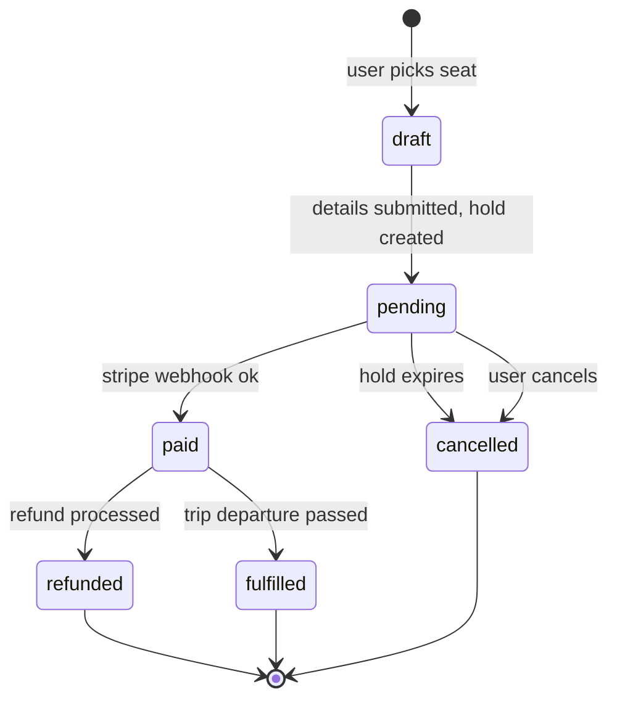
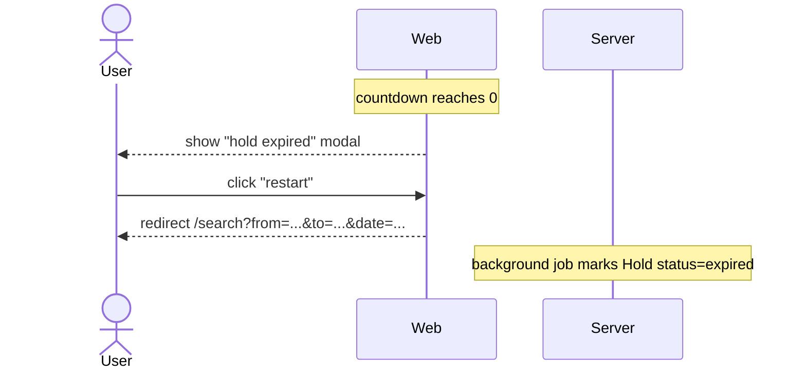
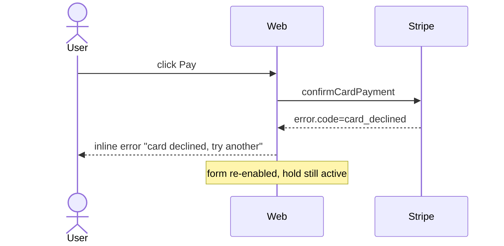
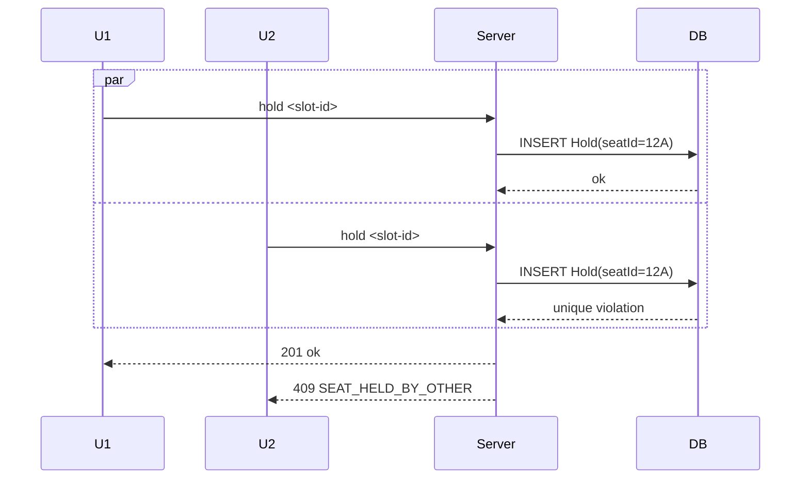

# User Flow

Mermaid sequence + state diagrams for multi-step flows. Output is a flow contract — every screen, transition, and side effect named.

> **Worked example below: perishable-hold checkout** (resource reserved for N minutes pending payment). Same flow instantiates as event-ticket / appointment-slot / hotel-room / parking-spot / restaurant-table booking — substitute `<Resource>` + `<slot-id>` per vertical; state machine, race-conditions, and recovery branches stay identical.

## Why you'd care

Multi-step flows designed screen-by-screen lose the branch and error paths that drive most of the support volume. A sequence or state diagram is what makes the happy path and the failure paths equally visible.

## When This Skill Applies

Activate when:
- User says "user flow", "journey", "sequence diagram", "state diagram", "state machine", "happy path", "/user-flow"
- Flow spans 2+ screens or 2+ async steps
- Wireframes exist but transitions between them aren't documented
- Pre-implementation review for multi-step features (checkout, sign-up, refund, dispute)
- After PRD, before wireframes, to enumerate which screens are needed

## Prerequisites

- PRD or issue describing the feature.
- Acceptance criteria covering the flow's goals.
- Decision: actor scope (single user? user + system? user + admin?).

## Steps

1. **Identify flow scope.** One flow = one file. Don't combine checkout + reservation; they're separate flows.
2. **List actors.** User, server, DB, external (Stripe, email provider). Each becomes a swimlane.
3. **Enumerate states.** From flow start to end. Include error/recovery states. Use state-machine if flow has lifecycle (e.g., booking: pending → paid → fulfilled).
4. **Draw sequence diagram.** Mermaid `sequenceDiagram`. Happy path first.
5. **Draw state diagram if applicable.** Mermaid `stateDiagram-v2`. Show state + valid transitions.
6. **Branch coverage.** For each decision point, document the alternative path (timeout, error, abandonment).
7. **Annotate side effects.** What writes to DB? What sends email? What emits event?
8. **Cross-reference screens.** Link each step to its wireframe (`docs/design/wireframes/<screen>.md`).
9. **Write** `docs/design/flows/<flow-slug>.md` (create dir if missing).
10. **Auto-chain.** Per branch → `/edge-case-enum`. Per side effect touching money → `/threat-model`.

## Output Format — `docs/design/flows/<flow>.md`

```markdown
---
flow: checkout
last-updated: YYYY-MM-DD
status: draft | reviewed | implemented
---

# Flow: Checkout

End-to-end booking confirmation: search → seat select → details → payment → success.

## Actors

| Actor | Role |
|-------|------|
| User | Booking consumer |
| Web | Next.js client |
| Server | Next.js route handlers + server actions |
| DB | Postgres (via Prisma) |
| Stripe | Payment processor |
| Mailer | Resend / Postmark |

## Screens

| Step | Screen | Wireframe |
|------|--------|-----------|
| 1 | <Resource> search results | docs/design/wireframes/search-results.md |
| 2 | Seat selection | docs/design/wireframes/seat-select.md |
| 3 | Passenger details | docs/design/wireframes/checkout-details.md |
| 4 | Payment | docs/design/wireframes/checkout-payment.md |
| 5 | Success | docs/design/wireframes/checkout-success.md |

## State Machine — Booking lifecycle



Allowed transitions only. Rejected transitions throw 409.

## Sequence — Happy Path

```mermaid
sequenceDiagram
    actor User
    participant Web
    participant Server
    participant DB
    participant Stripe
    participant Mailer

    User->>Web: pick <slot-id>
    Web->>Server: POST /api/bookings/:id/holds
    Server->>DB: INSERT Hold (active, expires=now+5m)
    Server-->>Web: 201 { holdId, expiresAt }
    Web-->>User: redirect /checkout/details

    User->>Web: submit details
    Web->>Server: server action submitDetails
    Server->>DB: UPDATE Booking SET passenger=...
    Server-->>Web: redirect /checkout/payment

    User->>Web: click Pay
    Web->>Server: POST /api/payments/intent
    Server->>Stripe: createPaymentIntent
    Stripe-->>Server: pi_xxx + client_secret
    Server-->>Web: { client_secret }
    Web->>Stripe: confirmCardPayment(client_secret)
    Stripe-->>Web: success
    Stripe->>Server: POST /api/webhooks/stripe (payment_intent.succeeded)
    Server->>DB: UPDATE Booking SET status=paid; UPDATE Hold SET status=converted
    Server->>Mailer: sendBookingConfirmation
    Server-->>Stripe: 200
    Web-->>User: redirect /checkout/success
```

## Branches & Error Paths

### B1: Hold expires mid-flow

Trigger: user idles on payment screen past hold.expiresAt.



UX: modal blocking, no dismiss. Booking left in `draft`; sweep job cancels after 1h.

### B2: Stripe declines card

Trigger: `Stripe.confirmCardPayment` returns error.



### B3: Stripe webhook delayed

Trigger: webhook arrives > 30s after success.

UX: success screen polls `GET /api/bookings/:id` every 2s, shows "confirming..." until status=paid. After 30s, switch to "we'll email confirmation" and free the screen.

### B4: User abandons

No explicit action. Hold expires per B1. Booking sweep cancels at hold.expiresAt + 1h.

### B5: Concurrent seat hold

Trigger: two users pick the same <slot-id> at same moment. DB partial unique index (`Hold(slotId) WHERE status=active`) lets one win.



## Side Effects Summary

| Step | Side effect |
|------|-------------|
| Hold create | INSERT Hold; schedule expiry job |
| Details submit | UPDATE Booking |
| Payment intent | Stripe API call (no DB write yet) |
| Webhook payment_intent.succeeded | UPDATE Booking → paid; UPDATE Hold → converted; emit `booking.paid`; send confirmation email |
| Webhook charge.refunded | INSERT Refund; UPDATE Booking → refunded; emit `booking.refunded`; send refund email |

## Idempotency

| Endpoint / event | Key |
|------------------|-----|
| POST /api/bookings/:id/holds | client `Idempotency-Key` header |
| POST /api/payments/intent | bookingId (one intent per booking) |
| Stripe webhook | event.id deduplicated in `webhook_events` table |

## Open Questions

- Guest checkout vs forced sign-up? Guest in MVP, defer auto-account.
- Cancel from success screen? Defer; refund flow is separate.

## Out of Scope

- Refund flow (separate file: `docs/design/flows/refund.md`).
- Admin reservation override (separate file).
```

## Boundaries

- **Mermaid only.** No prose-only flows. Visual is the contract.
- **Branches mandatory.** A flow with no error path is incomplete.
- **State machines for lifecycles.** If entity has status field, draw the transitions explicitly.
- **No code, no SQL.** Step labels reference the operation; details belong in api-contract / data-model.
- **One flow per file.** Compose by linking, don't merge.

## Re-run Behavior

- If file exists, read first. Surface diff vs proposed.
- Bump `last-updated`.
- Status: draft → reviewed → implemented.

## Auto-chain

- Each branch → `/edge-case-enum` (what could go wrong inside this branch?).
- Each money/PII side effect → `/threat-model`.
- Each new screen referenced → `/ui-wireframe` if missing.
- State machine → encode invariants in `/data-model-design` (status field constraints).

## Example Trigger

User: "diagram the checkout flow including the failure paths"
→ List actors, draw state machine + happy path sequence + 4-5 branch sequences, list side effects, write `docs/design/flows/checkout.md`.
