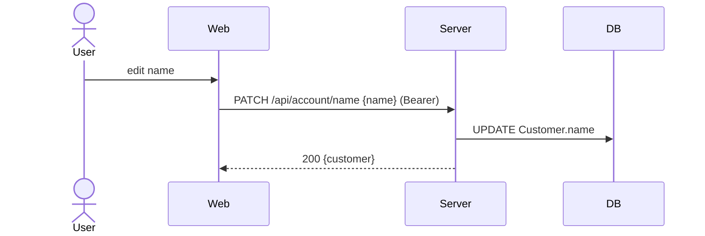
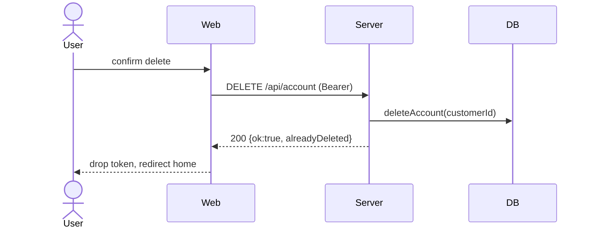

# Flow: Account Settings (name / password / phone-change / soft-delete)

Issue 008. Bearer auth (`requireCustomerAuth`). Phone-change is OTP-gated
(init→confirm). Soft-delete is idempotent (200 + discriminator).

## Actors

| Actor | Role |
|-------|------|
| User | Authenticated customer |
| Web | `/account/settings` client |
| Server | `/api/account/*` handlers |
| DB | Postgres via Prisma (Customer, Session, CustomerOtp) |
| SMS | eSMS stub (phone-change OTP) |

## Screens

| Step | Screen | Wireframe |
|------|--------|-----------|
| 1 | Settings (name, password, phone, delete) | docs/design/wireframes/account-settings.md |

## Sequence — Name edit



## Sequence — Change password

```mermaid
sequenceDiagram
    actor User
    participant Web
    participant Server
    participant DB
    User->>Web: current + new password
    Web->>Server: PATCH /api/account/password {current, new} (Bearer)
    Server->>Server: bcrypt compare current
    Server->>DB: UPDATE password; revoke other sessions
    Server-->>Web: 200
```

## Sequence — Phone change (OTP init→confirm)

```mermaid
sequenceDiagram
    actor User
    participant Web
    participant Server
    participant DB
    participant SMS
    User->>Web: enter new phone
    Web->>Server: POST /api/account/phone/init {newPhone} (Bearer)
    Server->>DB: issue OTP to NEW phone
    Server->>SMS: send code (stub)
    User->>Web: enter code
    Web->>Server: POST /api/account/phone/confirm {code} (Bearer)
    Server->>DB: verify OTP; UPDATE Customer.phone
    Server-->>Web: 200 (P2002 collision → generic PHONE_TAKEN)
```

## Sequence — Soft-delete



## Locked decisions (Issue 008)

1. **Phone anonymization = NULL** — `deleteAccount` sets phone NULL (frees it,
   avoids unique collision; deleted rows excluded via `deletedAt:null`).
2. **Session invalidation** — `session.updateMany({customerId},{revokedAt:now})`
   + client drops token. No tokenEpoch.
3. **Soft-delete retains Booking rows** — Booking snapshots buyer fields;
   only Customer is anonymized.
4. **Phone-change collision** — generic non-enumerating error (P2002→PHONE_TAKEN).

## Branches & Error Paths

- Unauthenticated → 401 on every endpoint.
- Delete is idempotent: second call → 200 `{alreadyDeleted:true}` (discriminated
  result from `deleteAccount`, NOT thrown sentinel).
- Phone-change OTP shares the lockout-sentinel + attempt-cap logic from auth flow.
- Password change revokes sibling sessions (keeps current).

## Side Effects Summary

| Step | Side effect |
|------|-------------|
| name | UPDATE Customer.name |
| password | UPDATE password; revoke other Sessions |
| phone/init | issue CustomerOtp to new phone; SMS |
| phone/confirm | UPDATE Customer.phone |
| delete | anonymize Customer (phone NULL, deletedAt=now); revoke all Sessions; retain Bookings |

## Idempotency

| Endpoint | Key |
|----------|-----|
| DELETE /api/account | customerId (alreadyDeleted discriminator) |
| phone/confirm | OTP row consume |

## Open Questions
- Re-auth prompt before delete? Currently single-confirm.

## Out of Scope
- Account data export (GDPR-style).
