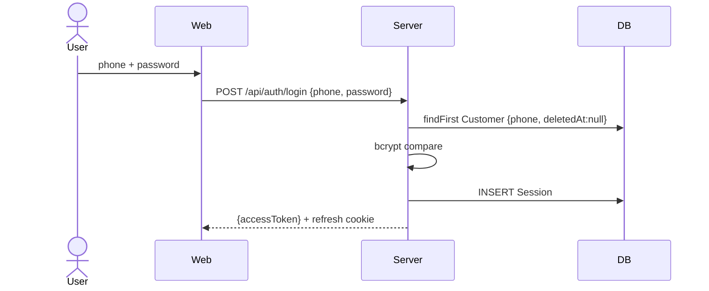

# Flow: Auth (register / login / forgot+reset via OTP)

OTP-driven. Verified-phone state crosses route boundaries via a short-lived
HS256 `otpProof` JWT (Mistake Log — NOT a server-session row). Local OTP read
via `GET /api/auth/otp/test-peek` (dual-guard: `OTP_PEEK_ENABLED=true` +
`NODE_ENV!=='production'`).

## Actors

| Actor | Role |
|-------|------|
| User | Customer |
| Web | Next.js client (auth pages) |
| Server | route handlers (`/api/auth/*`) |
| DB | Postgres via Prisma (Customer, CustomerOtp, Session) |
| SMS | eSMS stub (`_testOtpSink` locally) |

## Screens

| Step | Screen | Wireframe |
|------|--------|-----------|
| 1 | Register (phone→OTP→profile) | docs/design/wireframes/auth.md |
| 2 | Login (phone+password) | docs/design/wireframes/auth.md |
| 3 | Forgot-password (phone→OTP) | docs/design/wireframes/auth.md |
| 4 | Reset-password | docs/design/wireframes/auth.md |

## Sequence — Register (OTP)

```mermaid
sequenceDiagram
    actor User
    participant Web
    participant Server
    participant DB
    participant SMS

    User->>Web: enter phone
    Web->>Server: POST /api/auth/otp/send {phone}
    Server->>DB: upsert CustomerOtp (code, expires=now+5m)
    Server->>SMS: send code (stub sink locally)
    User->>Web: enter code
    Web->>Server: POST /api/auth/otp/verify {phone, code}
    Server->>DB: verifyOtp → ok | mismatch | gone | attempt_cap
    Server-->>Web: {otpProof} (HS256, 5m TTL, purpose=otp_proof)
    User->>Web: enter name + password
    Web->>Server: POST /api/auth/register {otpProof, name, password}
    Server->>Server: jwt.verify(otpProof) + jti-consume (one-shot)
    Server->>DB: INSERT Customer; INSERT Session
    Server-->>Web: {accessToken} + refresh cookie
```

## Sequence — Login



## Sequence — Forgot + Reset

```mermaid
sequenceDiagram
    actor User
    participant Web
    participant Server
    participant DB

    User->>Web: forgot-password, enter phone
    Web->>Server: POST /api/auth/forgot-password {phone}
    Server->>DB: issue OTP (generic response — non-enumerating)
    User->>Web: enter code
    Web->>Server: POST /api/auth/forgot-password/verify {phone, code}
    Server-->>Web: {otpProof purpose=reset}
    User->>Web: new password
    Web->>Server: POST /api/auth/reset-password {otpProof, password}
    Server->>Server: jwt.verify + jti-consume
    Server->>DB: UPDATE password; revoke all sessions
    Server-->>Web: 200 → redirect /auth/login
```

## Branches & Error Paths

### B1: OTP verify outcomes (route verbatim)
ok→{otpProof}; gone→400 `expired`; mismatch→400 `invalid`; attempt_cap→429.

### B2: Lockout sentinel (Mistake Log I010)
3rd verify mismatch → reuse OTP row: `consumed=true` + `expiresAt=now+15min`.
`findLockoutSentinel(phone)` (`consumed AND attemptCount>=3 AND expiresAt>NOW`)
checked BEFORE send-OTP and verify-OTP.

### B3: otpProof replay
Single-use via jti consume (Redis SETNX). 5min TTL. `otpProof` is in the
logger redact list.

### B4: non-enumeration
forgot-password returns generic success regardless of phone existence.
Deleted customers excluded via `deletedAt:null` (findFirst, not findUnique).

## Side Effects Summary

| Step | Side effect |
|------|-------------|
| otp/send | upsert CustomerOtp; SMS stub |
| otp/verify ok | mint otpProof JWT |
| register | INSERT Customer + Session |
| login | INSERT Session |
| reset-password | UPDATE password; revoke all Sessions |

## Idempotency

| Endpoint | Key |
|----------|-----|
| otp/send | phone (partial-unique active OTP row, ON CONFLICT) |
| register / reset | otpProof jti (one-shot) |

## Open Questions
- Refresh-token rotation cadence (`/api/auth/refresh`) — defer.

## Out of Scope
- Social login / OAuth.
