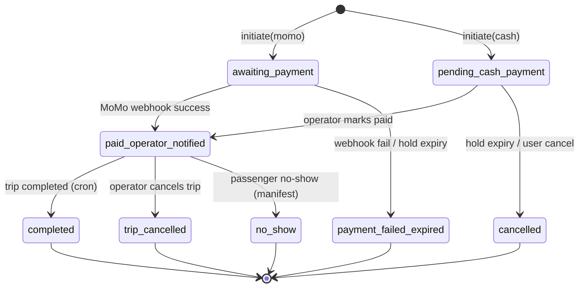
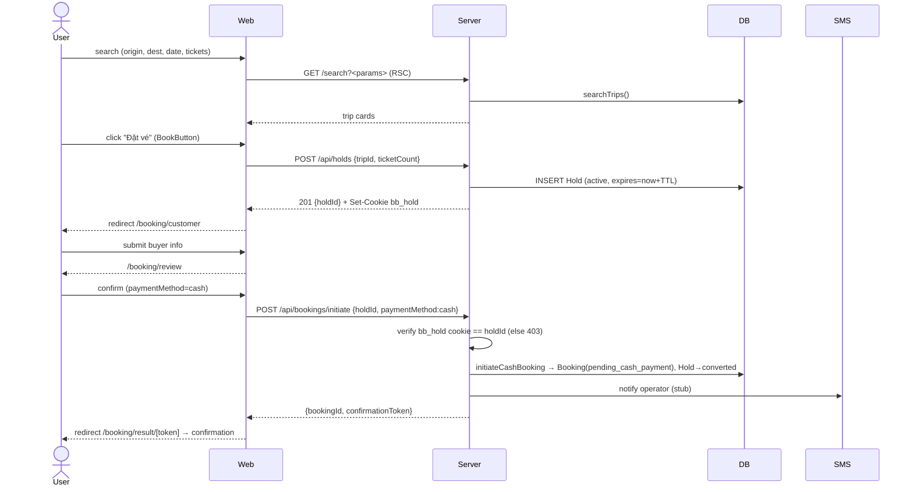

# Flow: Customer Booking (search → hold → pay → confirm)

Golden path is **cash**. MoMo is the alt-pay branch (handlers exist; full e2e
expected-skip locally — Phase B). ZaloPay / card are OUT of scope (Zod wall in
`/api/bookings/initiate` rejects anything but `cash` | `momo`).

## Actors

| Actor | Role |
|-------|------|
| User | Booking consumer (guest, no auth required) |
| Web | Next.js client (search form, review, result pages) |
| Server | RSC + route handlers (`/api/holds`, `/api/bookings/initiate`) |
| DB | Postgres via Prisma |
| MoMo | Payment gateway (alt-pay branch only) |
| SMS | eSMS stub locally (operator notification on cash confirm) |

## Screens

| Step | Screen | Wireframe |
|------|--------|-----------|
| 1 | Search form + results | docs/design/wireframes/customer-search.md |
| 2 | Buyer info (CustomerForm) | docs/design/wireframes/customer-booking.md |
| 3 | Review + pay-method | docs/design/wireframes/customer-booking.md |
| 4 | Result (MoMo poll) | docs/design/wireframes/customer-booking.md |
| 5 | Confirmation | docs/design/wireframes/customer-booking.md |

## State Machine — Booking lifecycle



BookingStatus enum (schema.prisma): awaiting_payment, pending_cash_payment,
paid_operator_notified, completed, cancelled, trip_cancelled, no_show,
payment_failed_expired.

## Sequence — Happy Path (cash)



## Sequence — Alt-pay (MoMo, Phase B)

```mermaid
sequenceDiagram
    actor User
    participant Web
    participant Server
    participant MoMo

    User->>Web: confirm (paymentMethod=momo)
    Web->>Server: POST /api/bookings/initiate {holdId, paymentMethod:momo}
    Server->>DB: Booking(awaiting_payment)
    Server->>MoMo: create payment
    MoMo-->>Server: payUrl
    Server-->>Web: {bookingId, payUrl}
    Web-->>User: redirect MoMo payUrl
    MoMo->>Server: POST /api/payments/momo/webhook (HMAC)
    Server->>DB: success→paid_operator_notified; fail→payment_failed_expired
    Note over Web: result page <meta refresh> 5s poll, cap 24 (~2min)
```

## Branches & Error Paths

### B1: Hold expires mid-flow
`/booking/layout.tsx` guards pre-booking pages on `bookingStore.tripId`;
`/booking/confirmation` + `/booking/result` bypass (token IS the access key).
HoldExpiryModal interrupts on countdown=0 → restart at /search.

### B2: initiate error map (route verbatim)
hold_not_found→404, hold_expired→409, trip_departed→409, ref_collision→503,
gateway_error→502 (momo only). Invalid body→400, cookie mismatch→403, rate
limit→429+Retry-After.

### B3: MoMo result codes
Pending=9000; FAILURE_RESULT_CODES pinned `{1001,1002,1003,1004,1005,4100}`
(Mistake Log — sourced from AC verbatim, NOT vendor-doc superset).

### B4: result-page poll cap
`<meta httpEquiv="refresh">` every 5s, capped 24 via `?r=` counter (~2min),
then "stopped auto-refresh" + manual reload link.

## Side Effects Summary

| Step | Side effect |
|------|-------------|
| Hold create | INSERT Hold; Set-Cookie bb_hold; schedule sweep |
| initiate cash | Booking→pending_cash_payment; Hold→converted; operator SMS |
| initiate momo | Booking→awaiting_payment; MoMo create |
| MoMo webhook | Booking→paid/failed; emit notify |
| Trip complete (cron) | Booking→completed; T+3 payout schedule |

## Idempotency

| Endpoint / event | Key |
|------------------|-----|
| POST /api/holds | bb_hold cookie |
| POST /api/bookings/initiate | holdId (one Booking per hold; ref_collision→503) |
| MoMo webhook | bookingId + result code; dedup on status transition |

## Open Questions
- Guest-only at booking; account-link is post-hoc via `attachGuestBookingByPhone`.
- MoMo full e2e deferred to Phase B (sandbox creds).

## Out of Scope
- ZaloPay (005), card (006) — Zod wall, no handlers.
- Refund flow.
