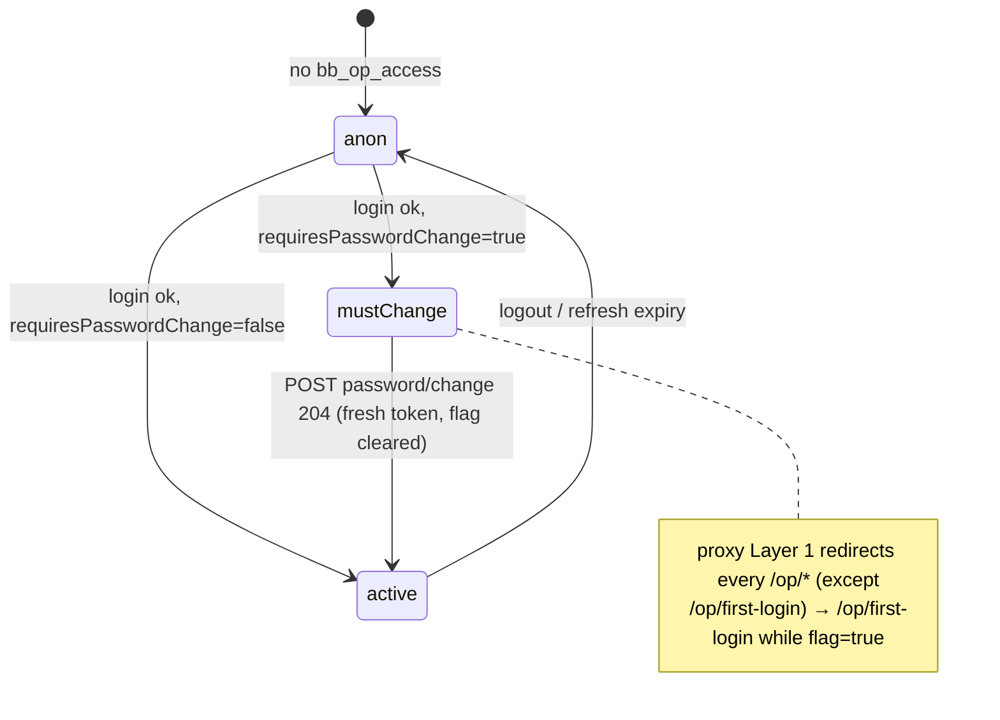
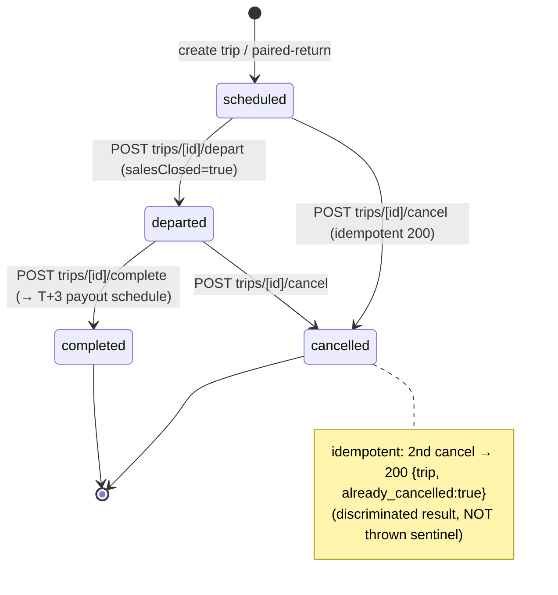
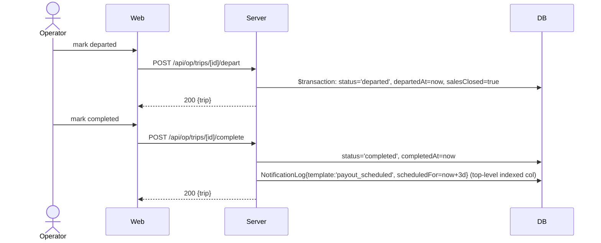
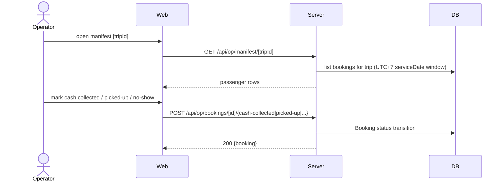

# Flow: Operator (login → first-login forced change → dashboard → fleet/routes/trips/manifest/reports/staff)

Operator login is UNIFIED into the customer route `POST /api/auth/login`
(`{scope:'operator'}` discriminant → `operatorLogin`). NO separate
`/api/op/auth/login`. Operator session = two HttpOnly cookies (`bb_op_access`
15min, `bb_op_refresh` 30d). Edge guard in `proxy.ts` Layer 1 reads JWT claims
(`operatorId`, `requiresPasswordChange`) with zero DB hits.

## Actors

| Actor | Role |
|-------|------|
| Operator | Authenticated operator user (staff/admin of one Operator company) |
| Web | Next.js client (`/op/*` pages + `*Client.tsx`) |
| Proxy | `proxy.ts` Edge guard (Layer 1 op-redirect, Layer 2 CSRF) |
| Server | route handlers (`/api/auth/login`, `/api/op/*`) |
| DB | Postgres via Prisma (OperatorUser, Operator, Bus, Route, Trip, Booking, Payout, NotificationLog) |
| SMS | eSMS stub (operator forgot-password OTP, booking notifications) |

## Screens

| Step | Screen | Wireframe |
|------|--------|-----------|
| 1 | Login | docs/design/wireframes/operator-auth.md |
| 2 | First-login forced password change | docs/design/wireframes/operator-auth.md |
| 3 | Dashboard | docs/design/wireframes/operator-dashboard.md |
| 4 | Fleet (buses + maintenance) | docs/design/wireframes/operator-fleet.md |
| 5 | Routes (+ pickup-points) | docs/design/wireframes/operator-routes.md |
| 6 | Trips (+ templates, lifecycle actions) | docs/design/wireframes/operator-trips.md |
| 7 | Manifest [tripId] | docs/design/wireframes/operator-manifest.md |
| 8 | Reports (payouts, revenue) | docs/design/wireframes/operator-reports.md |
| 9 | Staff | docs/design/wireframes/operator-staff.md |

## State Machine — Operator session gate



## State Machine — Trip lifecycle (operator-driven)



TripStatus enum (schema.prisma): scheduled, departed, completed, cancelled.

## Sequence — Login (unified route, scope=operator)

```mermaid
sequenceDiagram
    actor Operator
    participant Web
    participant Server
    participant DB
    Operator->>Web: /op/login — phone + password
    Web->>Server: POST /api/auth/login {phone, password, scope:'operator'}
    Server->>DB: operatorLogin → findUnique OperatorUser {phone}
    Server->>Server: miss OR disabledAt!=null → dummyVerify + INVALID_CREDENTIALS (anti-enum)
    Server->>Server: verifyPassword; issueOperatorSession(id, requiresPasswordChange, operatorId)
    Server-->>Web: 200 {accessToken, operator, requiresPasswordChange}
    Server-->>Web: Set-Cookie bb_op_access(15m) + bb_op_refresh(30d)
    Web-->>Operator: requiresPasswordChange ? /op/first-login : /op/dashboard
```

## Sequence — First-login forced password change

```mermaid
sequenceDiagram
    actor Operator
    participant Web
    participant Proxy
    participant Server
    participant DB
    Operator->>Web: navigate any /op/* with requiresPasswordChange=true
    Web->>Proxy: request
    Proxy->>Proxy: decodeOperatorJwt → flag true → 307 /op/first-login
    Operator->>Web: current + new password
    Web->>Server: POST /api/op/auth/password/change {currentPassword, newPassword}
    Server->>Server: verifyOperatorAccess; verifyPassword(current)
    Server->>DB: update {passwordHash, requiresPasswordChange:false} + revokeAllOperatorSessions(except current)
    Server->>Server: issueOperatorSession(id, false, operatorId) — fresh token, flag cleared
    Server-->>Web: 204 + Set-Cookie bb_op_access + bb_op_refresh
    Web-->>Operator: redirect /op/dashboard
```

## Sequence — Fleet / Routes / Trips CRUD (representative)

```mermaid
sequenceDiagram
    actor Operator
    participant Web
    participant Proxy
    participant Server
    participant DB
    Operator->>Web: edit (e.g. add bus, reduce capacity, reassign bus)
    Web->>Server: POST/PATCH /api/op/<resource> (bb_op_access + X-CSRF-Token)
    Proxy->>Proxy: Layer1 op-guard ok; Layer2 CSRF header==cookie else 403
    Server->>Server: requireOperatorAuth (scope=operator, operatorId claim)
    Server->>DB: $transaction + SELECT..FOR UPDATE on gating row (TOCTOU guard)
    Server-->>Web: 200 {entity} | 422 validation | 409 overlap-conflict
```

## Sequence — Trip lifecycle: depart → complete (payout schedule)



## Sequence — Manifest + cash collection



## Branches & Error Paths

### B1: Stale token missing operatorId (Issue 011)
JWT without `operatorId` claim → treated as stale → force re-login (proxy +
`requireOperatorAuth` both reject). Prevents pre-Issue-011 tokens acting.

### B2: Validation-failure status codes (route verbatim, Issue 011 AC)
`plate_in_use`→422, `capacity_reduction_blocked`→422, `future_trips_assigned`
(deactivate)→422; `maintenance_overlap`→409 (overlap-conflict reserved for 409).

### B3: Idempotent cancel (Issue 013 AC3)
2nd cancel → 200 `{trip, already_cancelled:true}` — discriminated result from
`cancelTrip` detected INSIDE the `$transaction` lock, NOT a thrown sentinel.

### B4: SPEC CONFLICT — bus_overlap_with_outbound
422 in `paired-return` (AC6 verbatim) vs 409 in `reassign-bus` (I3 convention).
Both implemented per their AC; inline `// SPEC CONFLICT:` flags the divergence.
Resolution deferred to follow-up issue.

### B5: Operator forgot-password (OTP)
`/api/op/auth/forgot-password` (+verify, +reset) — OTP to operator phone; shares
lockout-sentinel logic from auth flow. CSRF-exempt prefix (no token pre-auth).

### B6: I7 price authority (Issue 013)
Operator IS the price authority for their trips — `/api/op/**` accepts `price`
on the POST body (I7-exempt; customer-facing `/api/holds|bookings|payments/**`
are NOT exempt).

## Side Effects Summary

| Step | Side effect |
|------|-------------|
| login | issueOperatorSession; Set-Cookie bb_op_access + bb_op_refresh |
| password/change | UPDATE passwordHash + requiresPasswordChange=false; revoke other sessions; mint fresh token |
| bus/route/trip CRUD | INSERT/UPDATE within $transaction + FOR UPDATE on gating row |
| trip depart | status=departed, departedAt, salesClosed=true |
| trip complete | status=completed, completedAt; NotificationLog payout_scheduled (scheduledFor=now+3d) |
| trip cancel | status=cancelled; cancel child bookings; notify (skipped if already_cancelled) |
| manifest action | Booking status transition (cash-collected / picked-up / no-show) |
| staff create/disable | INSERT/UPDATE OperatorUser (contactPhone==notificationPhone OK; no phones-differ CHECK) |

## Idempotency

| Endpoint | Key |
|----------|-----|
| POST /api/op/trips/[id]/cancel | trip status (already_cancelled discriminator) |
| POST /api/op/trips/[id]/depart | trip status (no re-depart) |
| POST /api/op/trips/[id]/complete | trip status (one payout schedule per trip) |
| password/change | session revoke + fresh token (re-run safe) |

## Open Questions
- Staff RBAC granularity (admin vs staff sub-roles) — currently flat operator scope.
- Reports CSV export auth parity with HTML report routes.

## Out of Scope
- Operator self-signup (provisioned via platform-admin CLI — Issue 020).
- Payout settlement execution (S19 cron reads scheduledFor; not operator-triggered).
